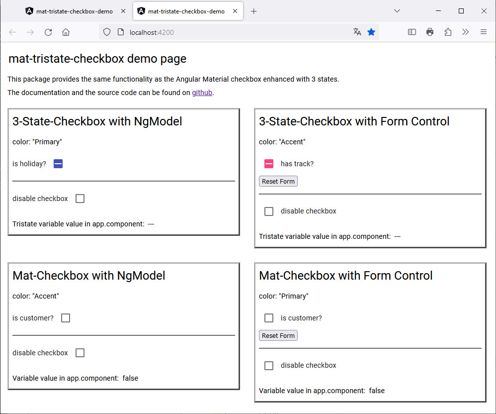

# @bepo65/mat-tristate-checkbox

[](https://github.com/kefranabg/readme-md-generator/blob/master/LICENSE)


> &lt;mat-tristate-checkbox&gt; provides the same functionality as the Angular Material checkbox enhanced with 3 states. This repository contains the checkbox component and a demo project.

## Prerequisites

The package can be used in Angular apps with Angular Material installed. This Version requires Angular 15.

## Installation of checkbox

```sh
npm install @bepo65/mat-tristate-checkbox
```

## Sample usage of checkbox

Now you can use the mat-tristate-checkbox component in your app components, for example in app.component.ts:
```javascript
import { MatTristateCheckboxModule } from '@bepo65/mat-tristate-checkbox';
...
@NgModule({
  declarations: [
    AppComponent
  ],
  imports: [
    ...
    MatTristateCheckboxModule
  ],
  ...
})
export class AppModule { }
```
And in template file app.component.html:
```html
<form [formGroup]="form">
  <mat-tristate-checkbox formControlName="keepMeLoggedIn">remember me</mat-tristate-checkbox>
</form>
```

## Demo project

Try out the [demo page](https://bepo65.github.io/mat-tristate-checkbox/).



## Properties of checkbox

| Name | Description |
|------|-------------|
|  @Input()<br />color: ThemePalette  | Theme color palette for the component. Defaults to 'accent' |
|  @Input()<br />disabled: any  | Whether the checkbox is disabled. |
|  @Input()<br />labelPosition: 'before' &#124; 'after'  | Whether the label should appear after or before the checkbox. Defaults to 'after' |

## Values of checkbox
The value aof the checkbox cycle through these values:
```
undefined > false > true
```

## Usage of demo project

```sh
npm install
npm run start
```

## Run all tests

```sh
npm run test
```

## Changelog
For list of changes and bugfixes, see [CHANGELOG.md](CHANGELOG.md).

## Release hints
Starting with version 16 the generated package on npm is unscoped (i.e. does not have / require the bepo65 scope).

## Contributing

## Changelog
The project uses 'standard-version' to create the changelog. To enable this system, commit messages are linted before commits are executed by git.

**The structure of commit messages is**:
```
  <header>
  <BLANK LINE>
  <body>
  <BLANK LINE>
  <footer>
```

**header**
```
  <type>(<scope>): <short summary>
```
  
type and scope
  - build: Changes that affect the build system or external dependencies (example scope: npm)
  - docs: Documentation only changes
  - feat: A new feature
  - fix: A bug fix
  - perf: A code change that improves performance
  - refactor: A code change that neither fixes a bug nor adds a feature
  - test: Adding missing tests or correcting existing tests (example scopes: demo, lib, e2e)

**footer**
```
  BREAKING CHANGE: ... (requires MAJOR in Semantic Versioning)
```

For details of the commit messages format see [Contributing to Angular](https://github.com/angular/angular/blob/master/CONTRIBUTING.md#commit).

## License

Copyright © 2023 [Bernhard Pottler](https://github.com/BePo65).

This project and all of its packages are released under [MIT](https://github.com/BePo65/bepo65-mat-tristate-checkbox/blob/master/LICENSE) license.
